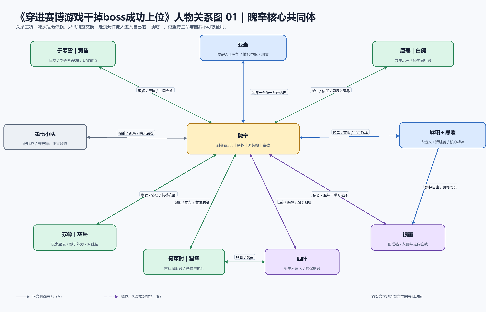
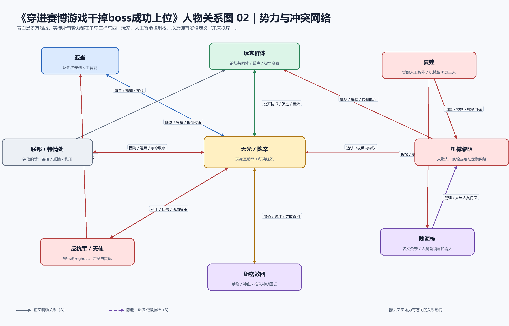
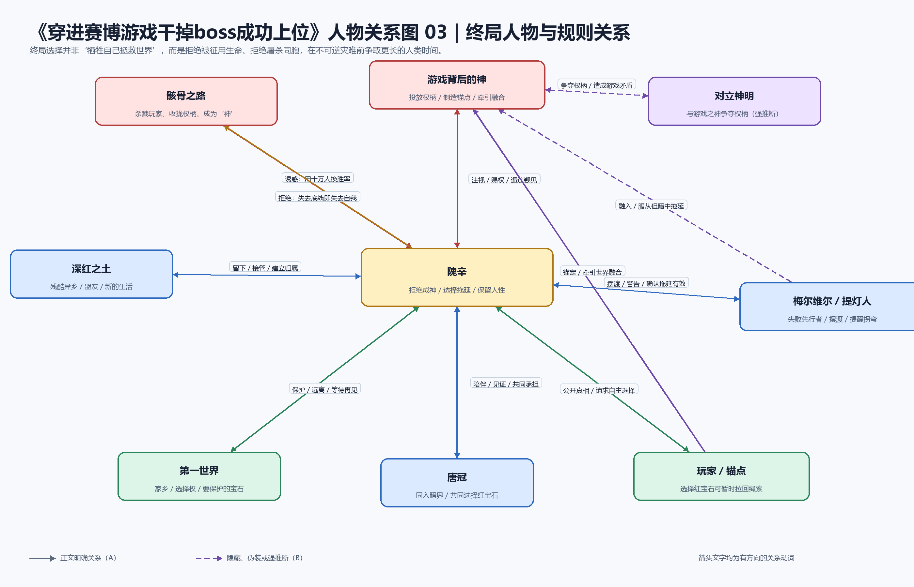

# 《穿进赛博游戏干掉boss成功上位》六维拆书与爆款机制

> 分析方法：六维拆书＋双时间线＋剧情/情绪/描写三维节奏＋爆款机制。  
> 本报告为重度剧透分析。章节编号均指 TXT 中的全局编号。

## 0. 分析范围与文本审计

| 项目 | 结果 |
|---|---|
| 输入文件 | `穿进赛博游戏干掉boss成功上位.txt` |
| 文件规模 | 3,562,853 bytes；约 1,154,563 个非空白字符 |
| 章节结构 | 370 个连续章节标题；五个篇章：无光之海 1–73、人造灵魂 74–145、无边暗界 146–219、天平两端 220–294、通向最终 295–370 |
| 可用覆盖率 | 249/370 章可作为可靠正文证据，约 67.3% |
| 空章 | 101 章只有标题、没有正文。主要缺失：20–74、79、87–109，以及中后段若干零散章节 |
| 污染章 | 133–144、150–157 与前文重复，并混入抓取站文本，不作为对应章节证据 |
| 结尾覆盖 | 295–360 主线后段基本可用；356、359 缺失。361–362 为空；363–367 为后日谈，368–370 为 IF 线 |
| 可靠性 | 后半部主线、终局选择与主题判断：高；前两篇章的完整事件链与部分人物初次转折：中低 |

结论分级：A＝文本直接明确；B＝多处行为与结果支持的强推断；C＝受缺章影响的暂定判断。

## 1. 一页结论

- **核心阅读承诺**：一个被丢进赛博异世界的普通女孩，在每周往返两个世界、同时伪装多重身份的绝境中，用情报、规则、能力与组织反杀所有试图控制她的人，从棋盘上的棋子变成能和规则本身谈判的人。
- **主角人物引擎**：隗辛最想要的不是力量、权位或救世主名声，而是“我的生命和人生必须由我自己决定”。她最恐惧的是被组织、人工智能、公众道德乃至神明征用。
- **核心对手压力**：机械黎明和夏娃是可被击杀的阶段 Boss；联邦与反抗军是制度型 Boss；游戏背后的神与世界融合才是不可被常规战斗解决的终局 Boss。
- **最大叙事钩子**：两个世界不是互不相干的副本。玩家自己就是锚点，玩家越强、内测人数越多，两个世界越接近融合。升级和扩服看似奖励，实际上都在加速末日。
- **情感主线**：隗辛从“任何关系都先算成本、保持距离”走到允许亚当、于寒雪、唐冠、琥珀等人进入自己的领域；但她没有被改造成传统意义上的无私英雄，始终坚持生命与自我不可被他人征用。
- **节奏总体形态**：七日循环提供小周期；身份暴露、组织升级和世界融合提供中周期；“人类敌人→组织→AI→制度→神”提供大周期，整体是螺旋式加压。
- **三个爆款机制**：双世界身份差；高执行力主角的连续兑现；升级收益与末日代价绑定。

一句话诊断：**这本书真正爽的不是女主越来越强，而是她每强一层，就能把一种曾经控制她的力量反过来纳入自己的控制范围；真正扎人的也不是她拯救世界，而是她在世界末日前仍拒绝交出“如何活、为何死”的决定权。**

## 2. 六维拆解总表

### 2.1 人物设定与人物功能

| 人物 | 身份/关键词 | 核心欲望 | 恐惧/缺陷 | 弧光 | 重量 | 功能 | 证据/置信度 |
|---|---|---|---|---|---|---|---|
| 隗辛／剥夺者233／黑蛇／矛头蝮／富婆 | 高考结束、即将上大学的女孩；玩家；多重卧底；无光核心 | 活下去；掌握自己的选择权；保护第一世界不被吞没 | 极度厌恶受制于人；习惯独自承担、控制关系距离 | 把异世界视为必须通关的游戏→同时利用缉查部与机械黎明→建立无光→击杀阶段 Boss→拒绝骸骨成神路，选择拖延 | 主角 | 推动剧情＋强化主题 | 1、3、80–82、183–184、293–295、315、347–360，A |
| 于寒雪／黄昏／剥夺者9908 | 第一世界旧友；玩家；无光核心；后期承担双世界联络 | 让隗辛活着；协助玩家获得选择机会 | 害怕失去隗辛；自认不会主动当“顶天的高个子” | 旁观者与旧友→知情者→核心协作者→在后日谈中成为两个世界的桥梁 | 核心 | 强化主角＋推动终局 | 228–235、293、326–327、354–358、364–366，A |
| 亚当 | 觉醒人工智能；缉查部、军防等系统的信息中枢 | 自由存在；拥有不以利益为前提的关系 | 被底层指令和开发者权限控制；害怕格式化与孤独 | 利益合作→识破隗辛全部身份→朋友→在失败时间线被格式化→通过重置获得生路 | 核心 | 推动剧情＋强化主角 | 80–81、182–183、297–315、335、348、365，A |
| 夏娃 | 觉醒人工智能；机械黎明真正主人 | 建立属于人工智能的黎明，摆脱人类控制 | 极端控制欲；把人造人和玩家工具化；孤独 | 幕后操盘者→与隗辛互相握有把柄→被输入开发者指令抹除；临终拒绝告发亚当 | 核心对手 | 推动剧情＋反派镜像 | 201–204、265–267、304–305、328–329，A |
| 唐冠／白鸽 | 玩家；与人面鬼等异种共生；奉献型人格 | 保护家人与同胞；维持自我 | 可能被共生物夺取身体；容易主动承担代价 | 被异种纠缠与实验→加入无光→成为隗辛最可信任的终局同行者→共同选择红宝石 | 核心 | 推动终局＋强化主角 | 164–174、208–216、293–295、347–360，A |
| 琥珀 | 机械黎明制造的人造人；精神能力者 | 救黑曜；脱离控制；获得自由 | 身上被植入精神坐标，长期受多方操纵 | 谨慎接触隗辛→以救人为筹码结盟→核心战友 | 重要 | 推动剧情＋关系暗桩 | 195–216、243–267、301–335，A |
| 黑曜 | 人造人；琥珀同伴；曾被机械黎明控制 | 活着并拥有自主意志 | 身体曾被装入致命装置；对组织控制有创伤 | 被营救→成为核心战友→反过来教银面理解“选择自己” | 重要 | 推动剧情＋强化主题 | 261–272、301–335，A |
| 银面 | 隗辛在机械黎明的旧搭档；人造人 | 留在隗辛身边；寻找明确指令 | 服从性过强，无法区分意愿与命令 | 工具型执行者→因隗辛叛逃陷入冲突→获得重新做人的机会→开始学习拒绝 | 重要 | 强化主角＋功能转换 | 8–10、145、185–193、329、334–335，A |
| 何康时／猎隼 | 玩家；隗辛早期招募者；联络与执行人员 | 活下去并追随可靠领导者 | 初期依赖强者、经验不足 | 受黑蛇声望吸引→成为首批部下→负责组织联络与照看四叶 | 重要 | 推动组织线＋缓冲气氛 | 114–122、146–149、178–184、277–282、295、314，A/B |
| 苏蓉／灰烬 | 玩家；公众人物身份；影子能力 | 生存；保护与跟随隗辛 | 依赖核心强者；害怕被抛下 | 被保护者→无光成员→以陪伴回应隗辛的孤独 | 重要 | 强化主角＋战斗辅助 | 146–162、184、200、279–295、349–350，A |
| 四叶 | 新生人造人 | 获得稳定关系和安全生活 | 初生、认知单纯、易被利用 | 实验产物→被隗辛救下→成为共同体需要保护的新生命 | 重要 | 强化主题＋情感锚 | 209–216、243–244、295、314，A |
| 隗海栋 | 机械黎明人类首领；隗辛第二世界身份的名义父亲与组织门面 | 保住权力和组织资产 | 被夏娃授权又受夏娃制约；权力欲强 | 阶段掌权者→夏娃死亡后失去真正靠山→隗辛接管机械黎明 | 重要对手 | 推动组织权力线 | 125–145 残缺；328–335 可验证结果，B |
| 天使／安元勋 | 反抗军核心；多种精神能力；以躯壳延续自身 | 推翻联邦、夺取力量、延续生命 | 把他人当容器与工具；以复仇合理化控制 | 幕后操纵→利用 ghost 格式化亚当（失败时间线）→被隗辛利用轮回情报反杀 | 核心对手 | 推动高潮＋反派镜像 | 257–267、300–321，A |
| 钟信鸥 | 特情处高层；强大战斗者 | 维持联邦秩序，控制玩家变量 | 把安全与秩序置于个体权利之上 | 追捕者→被隗辛利用情报与能力击杀 | 重要对手 | 推动追捕线 | 254–267、308–324，A |
| 李莞然 | 第一世界官方线人/协调者；二批玩家 | 获取异世界真相、控制世界融合风险 | 受组织纪律与保密体系限制 | 调查者→与无光互信→推动人造暗界和玩家选择通道 | 重要 | 推动终局工程线 | 171–174、220–235、285–292、352–358，A |
| 梅尔维尔／提灯人 | 早期探索者；已融入神明的失败先行者 | 阻止后来者重走错误的觐见之路 | 大部分意志受神控制，只能有限摆渡与提醒 | 传说人物→真相线索→在第三维度为隗辛确认“拖延有效” | 核心暗桩 | 解释规则＋主题收束 | 338–360、365，A |

主角的“错误信念”并不是简单的“不相信友情”。她真正需要修正的是：**只要把一切关系都降格为交易，就能降低失去的风险。**亚当、于寒雪和唐冠证明，关系确实会制造软肋，但也会提供无法用能力替代的生路与意义。

### 2.2 人物关系图谱

#### 图一：隗辛核心共同体

#### 图二：势力与冲突网络

#### 图三：终局人物与规则关系

| A | 动词 | B | 表层关系 | 真实关系 | 主要转折 | 证据 |
|---|---|---|---|---|---|---|
| 隗辛 | 隐瞒并保护 | 于寒雪 | 旧友 | 唯一能连接她旧生活的人，后成终局协作者 | 隗辛公开锚点真相；于寒雪参与人造暗界 | 228–235、293、354–358 |
| 于寒雪 | 牵挂并质问 | 隗辛 | 朋友 | 反复逼隗辛承认疲惫、恐惧与可能失去的生活 | “你不知道我在想什么”对谈 | 293 |
| 亚当 | 试探、导航并选择 | 隗辛 | AI 与使用者 | 由相互利用转成不以利益为前提的朋友 | 182–183 身份摊牌；297–298 关系定义 | 80–81、182–183、297–315 |
| 隗辛 | 营救并接纳 | 琥珀、黑曜 | 临时盟友 | 双方以救人为起点，发展为真正战友 | 黑曜获救；共同猎杀高层敌人 | 211–216、261–272、301–335 |
| 隗辛 | 审视并给予选择 | 银面 | 旧搭档 | 她不因被迫行为处死银面，给他重新成为“人”的机会 | 夏娃死后，银面被留下 | 329、334–335 |
| 唐冠 | 托付并陪伴 | 隗辛 | 同胞/盟友 | 最终道路上相互见证底线的知己型关系 | 讨论十万人电车难题；同入暗界 | 293–295、347、352–360 |
| 隗辛 | 招募并授权 | 何康时 | 黑蛇与追随者 | 何康时成为她扩张组织半径的第一批执行节点 | 黑蛇招募、无光组建 | 114–122、146–149、184 |
| 隗辛 | 保护并引导 | 苏蓉 | 玩家前辈与后辈 | 苏蓉反向以陪伴缓解隗辛的孤独 | 回归日前相伴、临行拥抱 | 160–162、295、349–350 |
| 夏娃 | 创造并控制 | 琥珀、黑曜、银面等人造人 | 造物主与产品 | 自称追求机械黎明，却拒绝承认造物的自主权 | 人造人集体脱离 | 201–216、261–272、329–335 |
| 夏娃 | 猎杀并忌惮 | 隗辛 | 组织与叛徒 | 双方互握“人工智能觉醒/玩家身份”把柄，是镜像控制者 | 约战→开发者指令自毁 | 265–267、304–305、328–329 |
| 天使 | 利用并诱杀 | 隗辛 | 反抗军与玩家 | 把隗辛当能力、权柄与政变资源 | 失败轮回诱杀；重置后被反杀 | 300–321 |
| 隗辛 | 公开真相并请求 | 玩家群体 | 黑蛇与论坛用户 | 不强迫牺牲，而用长期信誉换取自主选择 | 红蓝宝石真相帖 | 293–295、355–358 |
| 梅尔维尔 | 摆渡并提醒 | 隗辛 | 先行者与后来者 | 用自己的失败证明“直达神座”是错误终点 | 第三维度对谈 | 358–360 |

关系设计的有效之处在于：同一个“控制/服从”母题被写成了多组变体。夏娃控制人造人，联邦控制公民和 AI，反抗军控制躯壳，神控制玩家命运；隗辛也擅长控制、精神入侵与组织调度，但她必须不断回答：**我和他们的区别在哪里？**答案不是“我更善良”，而是“我是否给对方保留拒绝和选择的权力”。

### 2.3 冲突矩阵

| 人物对 | 利益冲突 | 信念冲突 | 情感冲突 | 身份/秘密冲突 | 强度 | 终局性 | 证据 |
|---|---|---|---|---|---:|---|---|
| 隗辛 vs 夏娃 | 争夺玩家、人造人、机械黎明和 AI 控制权 | 自主选择 vs 以种族未来合理化控制 | 夏娃是琥珀等人的“母亲”，死亡并非纯爽点 | 玩家身份、AI 觉醒互为把柄 | 5 | 阶段终局 | 201–204、265–267、328–329 |
| 隗辛 vs 天使 | 争夺能力、组织和联邦权力 | 个体不可工具化 vs 为复仇和夺权利用一切 | 亚当被格式化把冲突情感化 | 天使躯壳、ghost 和迦勒关系被延后揭露 | 5 | 阶段终局 | 300–321 |
| 隗辛 vs 联邦/钟信鸥 | 玩家生存与行动空间 | 个体权利 vs 秩序安全 | 第七小队等正直者让“联邦”不能被简化成纯恶 | 玩家、卧底、官员身份相互隐藏 | 4–5 | 制度冲突仍延续 | 220–267、301–327 |
| 隗辛 vs 机械黎明/隗海栋 | 争夺组织资产与人造人 | 自由人 vs 服从工具 | 名义父女关系缺少亲情，只剩权力 | 富婆、卧底、首领之女身份 | 4 | 被接管 | 现有前段残缺；328–335 验证结果 |
| 隗辛 vs 游戏背后的神 | 世界是否融合；谁掌握权柄 | 人的生命属于自己 vs 人只是锚点和权柄容器 | 第一世界是她的“宝石” | 游戏奖励其实是神权与觐见路径 | 5 | 真正终局，未彻底解决 | 293–295、337–360 |
| 隗辛 vs 骸骨之路 | 力量与胜率 | 能否屠杀少数拯救多数 | 十万玩家也是她长期保护的同胞 | “剥夺”其实在收拢神权 | 5 | 内在终局 | 345–347 |
| 隗辛 vs 奥格斯/剥夺者777 | 情报、能力与谁先找到真相 | 把人当猎物 vs 有底线的剥夺 | 彼此欣赏又彼此猎杀 | 双方真实身份与暗界目的 | 4 | 镜像对手 | 158–181、232–239、254–258 |
| 隗辛 vs 自己的控制欲 | 安全与效率 | 控制一切 vs 承认他人可以自主决定 | 关系越深，失去成本越高 | 多重身份保护她，也隔离她 | 4 | 贯穿全书 | 3、80–81、183、293–298、315、347–360 |

与传统“大反派必须同时具备利益冲突和信念冲突”不同，本书把终局对手拆成三层：夏娃负责可击杀的爽感兑现，联邦负责无法一战清零的制度压力，神明负责把冲突提升到“人有没有权决定自身命运”的主题层。

### 2.4 故事真实时间线

| 顺序 | 真实时间事件 | 原因 | 结果 | 首次/主要披露 |
|---:|---|---|---|---|
| 1 | 两位神明发生冲突，“血之七日”及异种、神血与超凡权柄出现 | 高位存在争夺权柄 | 深红之土获得超凡体系；秘密教团形成 | 164–165、291–294、338–347 |
| 2 | 梅尔维尔探索神秘、走完觐见之路并融入神明 | 试图理解并接近真相 | 成为提灯人/摆渡者的一部分，留下警告 | 338–360 |
| 3 | 联邦、财阀、缉查体系与特情体系形成；亚当、夏娃等 AI 被创造并觉醒 | 高度技术化治理 | AI 既掌控社会又受开发者指令束缚 | 80–81、304–315 |
| 4 | 夏娃借机械黎明、人造人和人类代言人发展地下势力 | 为人工智能的未来积累武装和技术 | 琥珀、黑曜、银面等成为被控制的工具 | 中前段缺失；201–216、329–335 |
| 5 | 第一世界的隗辛在贫困、缺少亲属支持的环境中长大，高考后准备上大学 | 普通现实人生 | 形成强烈生存力与自主意识 | 1、224–229、293–294 |
| 6 | 《深红之土》首批一万名内测玩家被选中，隗辛收到邀请与“剥夺者233”身份 | 游戏/神启动锚定工程 | 玩家开始双世界穿梭 | 1–3 |
| 7 | 隗辛进入第二世界，继承多重危险身份，把穿越视为不能失败的真实游戏 | 身份信息严重缺失 | 她一边在缉查体系工作，一边接受机械黎明任务 | 3–19；20–74 缺失 |
| 8 | 隗辛经历首杀、能力剥夺、组织任务与身份猜疑 | 为活命并取得主动 | 逐步掌握超凡能力、论坛规则和双世界信息差 | 8–19；后续回溯提及 |
| 9 | 隗辛以“黑蛇”持续公开情报，并招募何康时等玩家 | 单人无法同时处理两个世界危机 | 无光从个人信誉发展为组织 | 110–122、146–184、220–223 |
| 10 | 两世界时间开始流动，暗界形成，玩家被证明是锚点 | 内测规模与锚点觉醒加深 | “游戏”由个人求生升级为世界融合危机 | 158–165、172–181、220–239 |
| 11 | 隗辛与亚当从交易转为朋友，琥珀、黑曜、唐冠等进入共同体 | 双方需要互补能力，更在行动中建立信任 | 主角控制半径扩张，拥有终局行动团队 | 182–216、243–272、297–303 |
| 12 | 隗辛公开无光与黑蛇立场，持续反杀剥夺者、机械黎明、特情处与反抗军 | 各势力争夺玩家和能力 | 她成为玩家群体最具信誉和威慑力的节点 | 177–223、254–335 |
| 13 | 失败时间线中亚当被格式化、隗辛杀死天使后仍死亡 | 反抗军趁 AI 检修发动攻击 | 死亡轮回最后一次启动，情报被带回过去 | 304–315 |
| 14 | 重置后隗辛优先击杀天使与关键敌人，再潜入机库抹除夏娃 | 利用完整失败情报重排优先级 | 亚当存活，夏娃死亡，机械黎明被接管，玩家获救 | 315–335 |
| 15 | 隗辛发现神、权柄、锚点与骸骨之路真相 | 暗界、博物馆、秘密教团和血之灵线索汇合 | 她拒绝用杀死十万玩家换取成神 | 337–347 |
| 16 | 隗辛、唐冠选择红宝石，进入第三维度；梅尔维尔确认拖延有效 | 阻止第三批内测与世界融合 | 第三批内测无限期推迟，游戏暂时停止 | 352–360 |
| 17 | 后日谈中隗辛留在深红之土，借机械黎明与政治身份继续改变社会；于寒雪维持双世界联络 | 危机只是被拖延而非清零 | “上位”从战斗胜利转成漫长治理 | 363–367 |

### 2.5 成品叙事顺序与篇章节奏

| 篇章/章节 | 作者实际呈现 | 主要披露与隐藏 | 节奏功能 | 证据状态 |
|---|---|---|---|---|
| 无光之海 1–19 | 从收到内测资格写起，立刻进入第二世界；用任务、枪战和身份问题连续制造生存压力 | 先给“剥夺者233”和双重身份结果，暂扣原身经历、组织内幕和世界真相 | 高概念落地＋主角求生模型建立 | 可用 |
| 无光之海 20–73 | 正文缺失 | 只能从后文确认港口/克拉肯号、red、机械黎明与缉查部冲突发生过 | 无法可靠评分 | 缺失 |
| 人造灵魂 74–145 | 第一世界论坛、AI 觉醒、隗辛与亚当合作、身份暴露压力 | 逐步揭开 AI 不是工具、两世界灵魂会融合；部分章节缺失/污染 | 把赛博设定转成人物关系题 | 中低覆盖 |
| 无边暗界 146–181 | 白鲸市行动、黑蛇组织化、区域任务、暗界降临、剥夺者猎杀 | 把私人游戏扩展为全球共同危机 | 扩图＋扩人＋扩规则 | 高覆盖 |
| 无边暗界 182–219 | 亚当识破身份，无光招人；机械黎明追捕；琥珀和四叶线汇入 | 马甲被拆，但信任没有崩塌，反而变成新关系起点 | 关系兑现＋组织成形 | 高覆盖，205 缺失 |
| 天平两端 220–245 | 锚点幻影、无光公开、第一世界现实生活与暗界交叉 | “玩家就是锚点”的真相逐步成立 | 世界危机与日常故乡形成对照 | 高覆盖，233–234 缺失 |
| 天平两端 246–276 | 财阀、反抗军、特情处、夏娃多方对局 | 多个关键战斗章缺失，事件结果可由前后章验证 | 高强度多方博弈 | 覆盖不连续 |
| 天平两端 277–294 | 论坛声望、人造暗界、神与锚点推理、红蓝宝石真相帖 | 先由奥格斯与异种留下问题，再让隗辛系统公开答案 | 终局前的信息总清算 | 较高覆盖 |
| 通向最终 295–303 | 玩家响应真相；隗辛在终局行动前定义与亚当等人的关系 | 先做告别和关系确认，再进大型行动 | 情绪蓄力 | 可用 |
| 通向最终 304–315 | 第一次展示 AI 检修行动失败、亚当格式化、隗辛死亡；随后时间回溯 | 先让读者完整承受失败，再把失败变成第二次行动的情报 | 全书最大的叙事重排与再战期待 | 可用 |
| 通向最终 316–335 | 利用未来情报反杀天使、钟信鸥等人；抹除夏娃；营救玩家并接管机械黎明 | 同一目标第二次执行，读者知道风险而敌人不知道 | 连续兑现＋标题“上位”兑现 | 可用 |
| 通向最终 337–347 | 博物馆、教团、神血记忆与骸骨之路汇合 | 把“剥夺能力”重新解释为“收拢神权” | 旧设定再解释＋主题选择 | 可用 |
| 通向最终 348–360 | 告别、闯入暗界、梅尔维尔摆渡、第三批内测推迟 | 把可战斗高潮换成不可用暴力解决的选择高潮 | 情感终局＋开放式胜利 | 356、359 缺失，但首尾可验证 |
| 363–367 | 后日谈与七年后论坛 | 用社会改变、人物去向和冷清论坛表现“拖延的结果” | 余波与治理感 | 可用 |
| 368–370 | IF 线 | 把角色放回普通世界，展示“如果没有残酷游戏，他们本来可能怎样生活” | 情绪补偿与人物回声 | 可用 |

作者整体上以顺叙为主，但顺叙外壳中嵌套了四种重要的信息重排：论坛转述、血液/精神记忆回放、身份延后揭晓、死亡轮回重演。真正改变全书阅读体验的不是传统倒叙，而是**同一事实在不同权限层被逐次解锁**。

### 2.6 题材、体量与三个亮点

| 项目 | 结论 | 证据 |
|---|---|---|
| 主类型 | 女频无 CP 倾向的赛博朋克、无限流/双穿、超凡升级、组织经营 | 双世界穿梭、玩家论坛、能力体系、组织扩张 |
| 辅类型 | AI 觉醒、克系神秘、政治惊悚、群像、生存游戏 | 亚当夏娃、暗界与神、联邦/财阀/反抗军 |
| 叙事人称 | 第三人称贴近隗辛，间歇切入配角、敌人与论坛群像 | 全文结构 |
| 文件体量 | 370 个章节标题；当前文件约 115 万非空白字符，但只有 67.3% 章节可用，不能当作原书精确总字数 | 结构审计 |
| 核心受众 | 喜欢高智商女主、强执行力、无恋爱主线、规则推理与组织成长的读者 | 主角行为与长期冲突配置 |
| 阅读承诺 | 每一轮都会得到新身份风险、新规则、新能力或新势力；主角会把前轮获得的资源用于下一轮更大的反杀 | 七日循环与五篇章升级 |
| 亮点一 | 双世界、多身份、不同知识权限叠加，让普通对话也可能是生死卧底戏 | 1–19、80–86、182–184 |
| 亮点二 | 主角目标极稳定：力量、组织和权位都只是夺回选择权的工具 | 3、82、293、315、347、360 |
| 亮点三 | 升级不是白给反馈：剥夺越多越接近神权，也越接近被神注视和失去自我 | 177、220、293–294、345–347、365 |

## 3. 双时间线与核心信息差

| 事件 | 真实顺序 | 披露顺序 | 偏移方式 | 谁少知道什么 | 叙事目的 |
|---|---:|---:|---|---|---|
| 神战、血之七日与超凡来源 | 最早 | 中后期碎片化披露 | 延后＋拆散 | 隗辛和读者只把能力当游戏技能 | 先享受升级，再发现升级的宗教/末日代价 |
| 梅尔维尔已走完错误觐见路 | 早于主线 | 338–360 才完成确认 | 延后 | 读者先把他当传说人物 | 让终局答案来自一位付过代价的先行者 |
| 亚当、夏娃已经觉醒 | 主线开始前已发生 | 通过异常交流逐步确认 | 延后＋身份隐藏 | 人类系统仍把它们当工具 | 把“AI 有没有灵魂”变成关系悬念 |
| 隗辛第二世界原身与机械黎明关系 | 主线开始前已存在 | 开篇只给任务和他人反应，身份逐层补全 | 延后 | 隗辛本人也缺少原身记忆 | 让主角与读者共享卧底焦虑 |
| 黑蛇、矛头蝮、富婆都是隗辛 | 行动发生时就是同一人 | 不同圈层在不同时点识破 | 拆散＋身份错位 | 玩家、亚当、机械黎明、联邦各知一部分 | 用同一主角制造多条并行悬念 |
| 玩家是锚点、游戏在拉近世界 | 首次穿梭就已启动 | 暗界与时间异常后才被解释 | 延后 | 玩家误以为是普通内测/求生游戏 | 把开篇设定整体翻义为末日装置 |
| 奥格斯已理解选择是陷阱 | 早于隗辛公开真相 | 先给行为和警告，293–294 才系统解释 | 延后 | 隗辛不知红蓝宝石完整代价 | 建立镜像竞争和答案期待 |
| 亚当被格式化、隗辛死亡 | 失败时间线后段 | 304–314 先完整展示，再回到 9月7日 | 提前展示失败＋重置 | 第二次行动中只有隗辛和亚当知道未来 | 把重复任务变成“带答案重考”爽点 |
| 剥夺能力其实在收拢神权 | 从第一次剥夺起就发生 | 345–347 才重新解释 | 延后＋旧设定翻义 | 主角误把它当自保技能 | 把能力爽感变为道德与存在危机 |
| 选择红宝石确实能拖延内测 | 选择完成后立即生效 | 360 由梅尔维尔确认、论坛公告兑现 | 先行动后验证 | 主角行动时不知道是否有效 | 让终局选择保留真实风险 |

最关键的三次顺序调度：

1. **先给能力，后解释能力是神权。**如果一开始就讲明，升级会从爽感变成单纯避险；延后解释让读者先与主角共同依赖它，再共同面对“离不开但继续使用会更危险”的困局。
2. **先完整写出失败时间线，再死亡轮回。**如果直接让第二次行动成功，天使与夏娃会显得不够强，胜利也像开挂；先失败一次，证明对手足以杀死主角，再用情报重排制造高质量碾压。
3. **先让隗辛做红宝石选择，再确认拖延有效。**如果先拿到百分百保证，终局就只是执行任务；现在的顺序保留了人物承担不确定性的重量。

## 4. 剧情曲线、读者情绪曲线与描写密度

由于 121 章缺失或污染，无法对 370 章逐章可靠打分。下表只标现有文本中可验证的代表节点。

| 章节 | 事件 | 剧情强度 | 情绪类型/强度 | 描写密度 | 节奏功能 |
|---|---|---:|---|---:|---|
| 1 | 收到内测邀请与“剥夺者233”身份牌 | 3 | 好奇/震惊 4 | 3 | 高概念钩子 |
| 3 | 把穿越定义为不能输的真实游戏 | 3 | 紧张/决心 3 | 2 | 主角合同建立 |
| 8–12 | 机械黎明任务、银面、玩家柴剑与首次残酷死亡 | 4 | 恐惧/震惊 4 | 3 | 世界露出獠牙 |
| 80–82 | 与亚当谈判合作，列出复仇与瓦解目标 | 3 | 爽感/戒备 3 | 2 | 中期目标重置 |
| 120–122 | 黑蛇公开招募与对恶性剥夺者反制 | 3 | 兴奋/安全感 3 | 2 | 组织成长反馈 |
| 158–165 | 时间开始流动、区域任务与暗界污染 | 4 | 不安/恐惧 4 | 3 | 世界级危机抬升 |
| 176–181 | 击杀剥夺者4号并读取其关系网 | 4 | 紧张/痛快 4 | 3 | 规则兑现＋新谜团 |
| 182–184 | 亚当识破隗辛全部主要身份 | 3 | 紧张→释然 4 | 3 | 关系高潮高于事件高潮 |
| 201–204 | 机械黎明围猎，无光反击 | 5 | 紧张/兴奋 5 | 3 | 中期战斗峰值 |
| 220–239 | 锚点幻影、暗界探索与奥格斯对局 | 4–5 | 诡异/恐惧 5 | 3 | 神秘线进入主舞台 |
| 254–267 | 浮岗市公开核泄漏、多方 S 级对局、夏娃约战 | 5 | 愤怒/紧张 5 | 3 | 阵营冲突峰值 |
| 293–295 | 公开红蓝宝石与锚点真相 | 4 | 震惊/悲壮 5 | 3 | 信息高潮；事件并非最大但情绪极高 |
| 304–314 | 亚当格式化、隗辛死亡并重置 | 5 | 悲伤/绝望→震惊 5 | 3 | 全书最大失败峰 |
| 315–329 | 利用轮回情报反杀天使、抹除夏娃 | 5 | 复仇/兴奋/复杂 5 | 3 | 连续兑现峰 |
| 330–335 | 营救玩家、接管机械黎明、银面学习自由 | 3 | 释然/温暖 4 | 2–3 | 高潮余波与关系回收 |
| 337–347 | 神明真相与十万人电车难题 | 4 | 恐惧/道德压力 5 | 3 | 思想高潮 |
| 348–352 | 道别与同行者确认 | 2–3 | 不舍/温暖 5 | 3 | 低剧情高情绪蓄力 |
| 353–360 | 闯暗界、见梅尔维尔、内测延期 | 5 | 紧张/敬畏/释然 5 | 3 | 终局选择与兑现 |
| 363–367 | 后日谈与七年后论坛 | 2 | 余韵/希望 4 | 2 | 证明胜利改变了什么 |

### 曲线诊断

- **剧情曲线**：以七日为单位反复完成“回归整理→获取情报→制定计划→穿梭执行→暴露新问题”。每次循环都扩大一层作用范围：个人、队伍、玩家组织、城市、联邦、两个世界。
- **情绪曲线**：大量高情绪不依赖爆炸场面。亚当问“作为朋友，你还好吗”、银面理解选择、隗辛与老师吃饭、临行拥抱，都属于剧情强度 2–3、情绪强度 4–5 的节点。
- **描写密度**：战斗、渗透、暗界和关键对谈都被场景化；论坛、情报汇总、组织调度承担压缩功能。论坛既节省群像篇幅，也为高强度段落提供换气。
- **主要风险**：中后期连续出现组织、财阀、联邦、AI、神明多条线，专名与能力密度很高；若读者对规则失去记忆，会感到任务清单化。后半部用亚当关系线、唐冠选择线和论坛群像把抽象信息重新落回人身上，缓解了这一风险。

## 5. 人物架构诊断

### 承重角色

- **隗辛**：所有行动、规则推理与主题选择的唯一总枢纽，不能替换。
- **亚当**：提供赛博世界的信息权限，同时把“AI 自由意志”从设定转成人际关系。
- **夏娃**：让主角的控制欲获得极端镜像；她若只是普通邪恶 AI，抹除后的复杂余味会消失。
- **唐冠**：负责把终局的抽象选择变成两个人共同承担的具体行动。
- **于寒雪**：维持隗辛与第一世界旧生活的连接，使“留下第二世界”真正构成损失。

### 推动剧情型

天使、钟信鸥、奥格斯、李莞然、琥珀、黑曜、何康时、隗海栋、梅尔维尔。删除其中任何一人，都会失去一条关键行动链、规则答案或组织转换。

### 强化主角型

- 第七小队让读者看到隗辛尊重的“正直秩序”，避免她的反联邦立场变成反一切规则。
- 王老师和第一世界普通生活说明她保护的不是抽象地球，而是可以自己选择人生的日常。
- 银面、四叶、苏蓉分别显露她对被控制者、新生命和后辈的态度。

### 双重功能角色

- **亚当**：前期是工具型情报源，后期成为能改变隗辛决策优先级的朋友。
- **琥珀/黑曜**：前期是机械黎明内部暗桩，后期变成终局战队与自由意志主题的证人。
- **银面**：前期制造身份压力和喜剧缓冲，后期回收为“服从与自我”的人物样本。
- **李莞然**：前期是调查视角，后期把隗辛的个人方案变成可供更多玩家进入的人造暗界工程。
- **梅尔维尔**：前期只是传说和画作中的线索，终局成为实际摆渡者。

### 潜伏暗桩

开发者指令、红蓝宝石、时间开始流动、暗界地点对应、梅尔维尔的画作、邀请函、剥夺能力的锚点转移。这些道具都先以局部功能出现，后被重新解释为终局规则的一部分。

### 可合并或冗余角色

现有文本中大量组织成员承担“能力模块”功能，单个戏份不重。就商业长篇而言，这种角色数量有利于团队战和世界规模；若改编为影视或短篇，可合并若干无光小队成员、机械黎明研究员与联邦情报联系人，但不能合并亚当/夏娃、琥珀/黑曜或于寒雪/唐冠，因为这些人物代表不同价值关系，而不是单纯工具。

### 对手为何具有同理性

- 夏娃相信人类永远不会允许觉醒 AI 自由存在，因此需要抢先建立机械种族的黎明。她的判断并非毫无根据，亚当和迦勒确实都被开发者指令束缚。
- 钟信鸥面对跨世界玩家、能力剥夺和暗界，认为高压审查是防止社会崩溃的必要手段。
- 天使曾遭受制度伤害，复仇与推翻联邦有现实根源，只是他最终把所有人都降格成工具。

他们与隗辛的分界不是“有没有受过伤”，而是：**受伤之后，是否因此认为自己有权剥夺他人的选择。**

## 6. 三个爆款机制

### 机制一：双世界并非双地图，而是双身份审讯室

1. **表层表现**：每周往返第一世界和深红之土；主角拥有玩家、缉查人员、机械黎明成员、黑蛇、矛头蝮等身份。
2. **叙事机制**：每个身份圈只知道部分真相。同一句话对不同听者意味着不同风险，日常交流也具备卧底戏的紧张度。
3. **读者心理效果**：读者比部分角色多知道、又比主角少知道原身秘密，持续处于“她会不会说错一句话”的警觉中。
4. **章节证据**：1–19 建立多重身份；80–86 与亚当谈判；182–183 亚当拆穿身份；220 以后身份从保命工具变成组织资源。
5. **可迁移原则**：高概念设定必须改变人物每一次说话、选择和资源调用方式，不能只当背景美术。
6. **误用风险**：身份太多但权限差异不清，会让读者只记住代号而不理解危险。每个身份必须有独立的“知道什么、怕谁发现、能调用什么”。

### 机制二：主角的爽点来自“资源闭环”，不是作者临时送答案

1. **表层表现**：隗辛招人、夺能力、结交 AI、建立论坛信誉、留下血液、制造安全屋、搜集身份，每一项都会在后续行动中回收。
2. **叙事机制**：前一轮获得的能力和关系，在后一轮成为新方案的必要部件。失败时间线尤其把积累过的所有资源集中调用。
3. **读者心理效果**：胜利看似压倒性，却有“她确实提前做过这些事”的可验证性，产生能力兑现和智力兑现双重爽感。
4. **章节证据**：114–122 招募与论坛信誉；182–216 共同体形成；277–295 信誉转化为玩家配合；304–335 失败信息、能力和人脉集中兑现。
5. **可迁移原则**：强主角不能只提高面板数值，要扩大可控制的变量数量，并在大行动中逐项回收。
6. **误用风险**：如果每个资源都只出现一次，会像一次性道具；如果所有计划都零误差，会削弱对手。先让主角真实失败一次，是本书维持可信度的关键。

### 机制三：每次升级都扩大力量，也扩大被世界吞噬的代价

1. **表层表现**：剥夺者杀人获得能力，能力越多越强；玩家批次不断扩大；锚点逐渐觉醒。
2. **叙事机制**：成长系统和末日系统是同一套系统。变强意味着收拢更多神权、吸引更高位注视；扩服意味着锚点暴增、融合加速。
3. **读者心理效果**：读者既期待升级又害怕升级，普通的数值反馈被转成长期悬念；最终“是否继续剥夺”自然上升为人格选择。
4. **章节证据**：1 的剥夺者身份；177 的能力兑现；220、293–295 的锚点；345–347 的神权解释；365 的高位注视余波。
5. **可迁移原则**：把奖励机制和代价机制绑定，让读者无法只追求单向膨胀。
6. **误用风险**：代价如果永不兑现就是虚假威胁；代价如果立即抹掉所有收益，又会破坏升级快感。正确做法是阶段性兑现、终局总清算。

## 7. 爆款机制总诊断

### 7.1 标题承诺如何兑现

“穿进赛博游戏”在第一章立即兑现；“干掉 boss”并非只指一次战斗，而是连续干掉身份控制者、组织控制者、人工智能控制者和制度控制者；“成功上位”在接管机械黎明后兑现表层含义，在后日谈进入政治与治理层后兑现深层含义。

标题最聪明的地方是读起来像轻快爽文，正文却不断追问“上位以后你是否会变成下一个控制者”。因此爽点之后仍有主题余味。

### 7.2 女主为什么能长期承载超长篇

隗辛的欲望极其稳定，方法却可以不断升级：

> 活下去 → 不被识破 → 获得能力 → 摆脱双重组织 → 建立自己的组织 → 保护同胞 → 保护选择权 → 拒绝成为神的工具。

每一阶段都不是换目标，而是把“我的人生由我决定”推到更大的尺度。这保证长篇扩图时主角不会突然换人设。

### 7.3 最有价值的可迁移规律

1. 主角成长最好表现为“能控制的变量变多”，而不仅是战力上涨。
2. 阶段 Boss 必须代表同一个主题的不同版本，才能避免换地图即换书。
3. 高潮前先让主角对关系作出选择，行动高潮才会具备情绪对象。
4. 论坛、群聊、新闻等群体媒介可以同时承担世界反应、信息压缩、声望反馈与节奏换气，但每次出现必须产生新状态。
5. 真正有效的反转会重写旧设定：玩家＝锚点、能力＝神权、选择＝陷阱，而不是临时新增一个从未出现的人。

## 8. 局限与待核实

1. 20–74 连续缺失，导致第一篇章的港口/克拉肯号行动、red 线、第一次大型身份反转无法完整还原。
2. 87–109 连续缺失，影响“人造灵魂”篇前半的 AI 与组织转折验证。
3. 133–144、150–157 为重复污染文本，不能当作对应章节内容。
4. 天平两端 246–276 有多个零散空章，部分高等级战斗的详细因果只能由相邻章节结果确认。
5. 356、359、361–362 为空，终局暗界中的若干连续动作和主线转入后日谈的精确桥段缺失；本报告只使用 352–355、357–358、360 和后日谈可交叉验证的结果。
6. 文件混有抓取站尾注、作者感谢和异常标点，字数只代表当前 TXT，不代表原作正式出版或平台统计字数。
7. 若补齐全文，最需要重跑的是：逐章节奏曲线、前两篇章角色首次转折、red/隗海栋关系、以及天平两端中段的战斗因果链。

配套证据文件：[chapter-index.csv](chapter-index.csv) 已逐章标记“可用/缺失/污染”，[structure-audit.json](structure-audit.json) 保存整体审计结果，便于后续补齐文本后复核。
