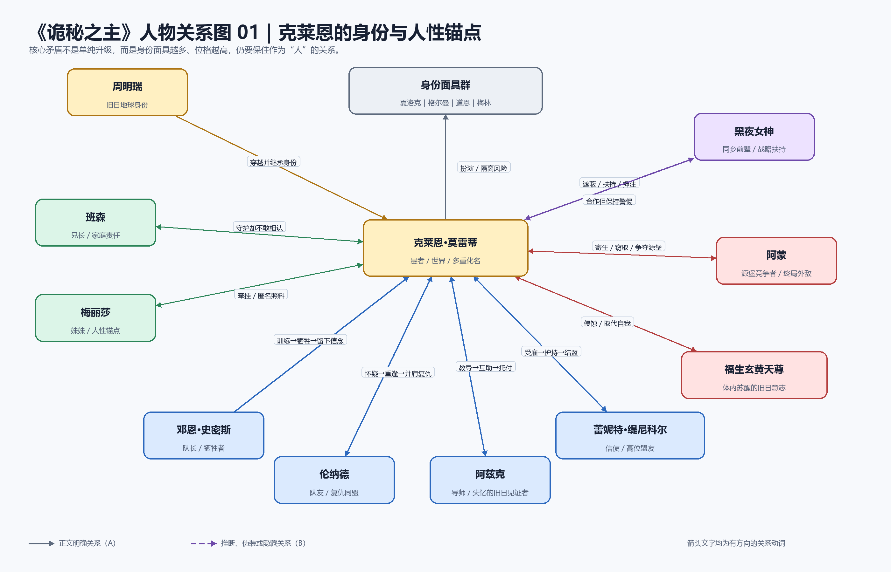
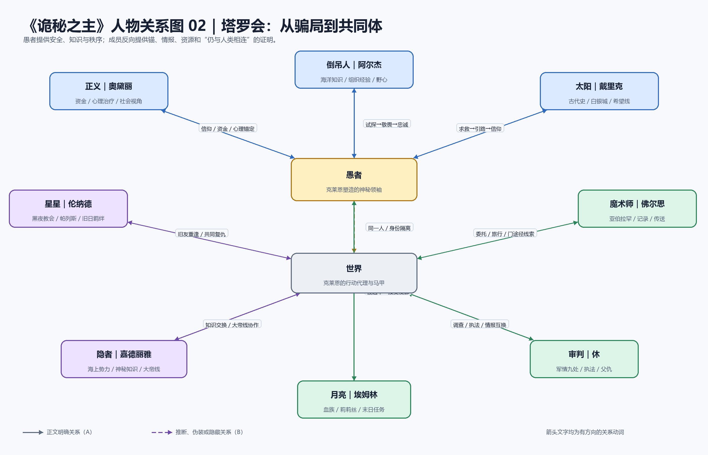
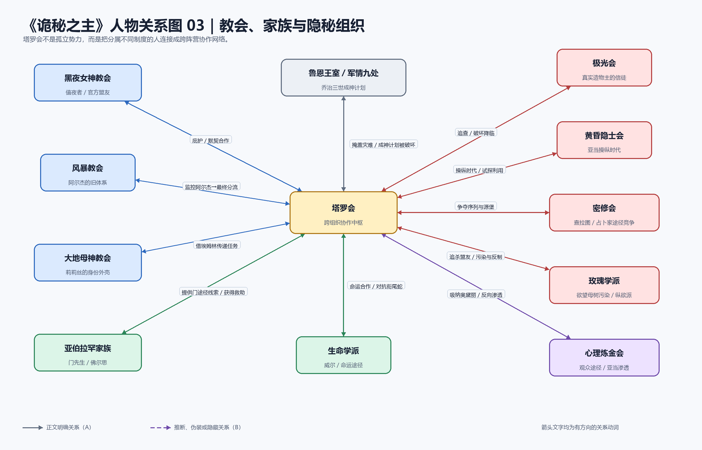
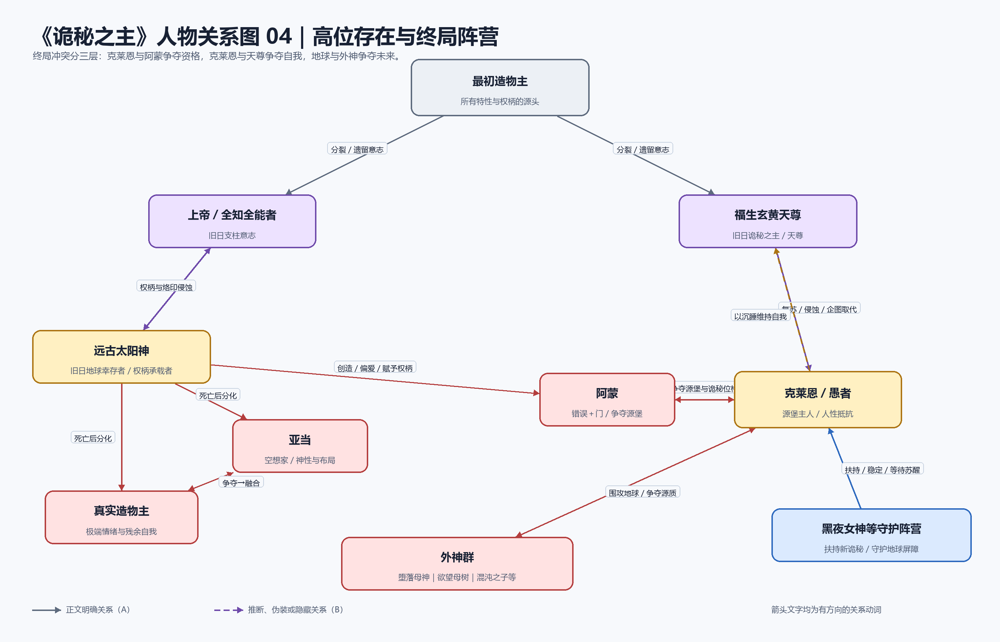

# 《诡秘之主》六维拆书与爆款机制

> 全文剧透。分析基于用户提供的 TXT，不使用后续续作或网络百科补写原作。

## 0. 分析范围

- 书名：《诡秘之主》
- 作者：爱潜水的乌贼
- 输入形式：完整八卷主线
- 正文覆盖：1394 章；从第一卷“**小丑**”第一章《绯红》，至第八卷“**愚者**”第四十一章《新的旅程》
- 卷章数：213／269／250／214／204／116／87／41
- 文件体量：约 455.6 万非空白字符；章节区间统计约 450.9 万字符，包含部分章末作者附注
- 叙事方式：以克莱恩为中心的第三人称限知为主，中后期逐渐增加多人物限知视角；第五卷明确尝试 POV 镜头式转场
- 文本污染：`（全书完）`之后混入完本感言、番外说明及其他小说片段，已排除；第八卷存在一次章号重复的源文件错误
- 证据索引：[chapter-index.csv](chapter-index.csv)
- 结论可靠性：主线事实 A；人物动机和结构解释多为 A／B；未由正文证实的神秘学细节不作补全

证据等级：

- **A 明确**：正文或作者卷末总结直接说明
- **B 强推断**：多处行动、代价和结果共同支持
- **C 暂定**：证据有限，存在其他解释

---

## 1. 一页结论

### 核心阅读承诺

读者会稳定获得五种体验：

1. 跟随一个“假神”探索未知世界，逐步把伪装变成真实位格。
2. 通过二十二条途径、魔药、扮演法、封印物和源质规则进行可参与的推理。
3. 每隔一段时间更换身份、职业、地图和社会阶层，获得新鲜感。
4. 通过塔罗会、罗塞尔日记和历史遗迹持续拼合世界真相。
5. 在克苏鲁式渺小感中，看一个人如何以牺牲和关系锚点保住人性。

### 主角人物引擎

> **回家欲望 → 发现无家可回 → 把现世的人当作新的故乡 → 为守住他们主动承担成神和失去自我的风险。**

克莱恩的外部升级目标不断变化，但内部问题始终是：“当我越来越不像人，我还能否记得自己为什么保护人？”

### 核心对手压力

- **早期外部对手：**因斯·赞格威尔与 0—08，证明幕后叙事本身可以杀人。
- **中期制度对手：**乔治三世、王室计划、战争和教会政治，迫使主角从个人复仇进入时代冲突。
- **终局人物对手：**阿蒙，与克莱恩争夺源堡和“诡秘之主”的资格。
- **终局内在对手：**福生玄黄天尊的复苏，直接争夺克莱恩的自我。
- **世界级压力：**外神围攻与末日倒计时。

### 最大叙事钩子

小说让读者和主角长期相信“周明瑞穿越到异世界”，到第六卷才用“切尔诺贝利”把整个世界重新命名为毁灭后的地球。这个揭密不只回答世界观问题，还同时摧毁主角最初的“回家”目标。

### 节奏总体形态

> 日常探索 → 小案件闭环 → 塔罗会信息结算 → 身份或序列升级 → 卷末集中爆发 → 换身份重启下一阶段。

八卷并非同一种节奏重复，而是依次采用中短篇闭环、社会群像、旅行体、层层回收、旋涡下沉、双峰结构、舒缓后骤爆、连续高潮加余韵。

### 三个爆款亮点

1. **可计算的未知：**规则足够明确，真相始终只揭开一层。
2. **身份换壳与固定锚点：**化名持续制造新鲜感，塔罗会负责累计感。
3. **从假神到真神的反讽成长：**升级越成功，失去人性的危险越大，爽点与代价被绑定。

---

## 2. 六维拆解总表

## 2.1 人物设定与功能

| 人物 | 身份／关键词 | 核心欲望 | 恐惧／致命缺陷 | 弧光 | 重量与功能 | 证据 |
|---|---|---|---|---|---|---|
| 周明瑞／克莱恩·莫雷蒂 | 男；占卜家途径；愚者、世界及多重化名；谨慎、善良、财迷式幽默、孤独 | 前期返回故乡；中期调查真相并保护身边人；后期守住地球和自我 | 害怕失控、疯狂、家人受牵连和自我被天尊取代；习惯独自承担、主动切断关系 | 从寻找回家方法，到承认故乡已毁；从冒充神明，到成为神明并以沉睡保存人格 | 绝对主角；推动剧情＋主题承载＋世界观视角 | 第一卷第1章；第六卷第16章；第八卷终局，A |
| 奥黛丽·霍尔／正义 | 贵族少女、观众途径；好奇、敏锐、富有同理心 | 最初追求神秘与成长，后来追求减少具体苦难 | 阶层滤镜；容易把帮助他人理解为有资源即可解决 | 从观看世界，到进入战争创伤并承担治疗者、行动者的责任 | 核心群像；社会视角＋心理锚点＋强化主角 | 第二、五、六、七卷，A |
| 阿尔杰·威尔逊／倒吊人 | 风暴教会成员、海上行动者；谨慎、野心、务实 | 获得力量、地位和行动自主权 | 把关系优先看成交易，惧怕失去制度保护 | 从试探愚者，到愿意放弃原有身份和晋升路线承担新使命 | 核心群像；组织情报＋现实主义镜像 | 第一卷塔罗会；第七卷选择，A |
| 戴里克·伯格／太阳 | 白银城少年；真诚、坚韧、信仰希望 | 带白银城摆脱诅咒、见到光 | 经验不足，早期容易被城内复杂势力利用 | 从被保护的少年成长为能够承担族群未来的领导者 | 核心群像；古代史入口＋希望主题 | 第一至六卷白银城线，A |
| 伦纳德·米切尔／星星 | 值夜者、帕列斯寄生者；散漫外表、重情、复仇 | 为队长和廷根牺牲者复仇，并查明克莱恩真相 | 习惯依赖“老爷爷”，早期责任感不够稳定 | 从队友幸存者变成独立半神与克莱恩的人性旧友 | 双重功能；旧关系锚点＋复仇推动者 | 第一、四卷，A |
| 阿兹克·艾格斯 | 死神途径高序列者；温和、失忆、循环复活 | 找回身世并摆脱过去人格的支配 | 记忆断裂，身份与情感无法连续 | 从神秘导师变成能选择自身身份的朋友 | 承重盟友；历史线索＋力量援助＋主角镜像 | 第一至四卷及后续书信，A |
| 罗塞尔·古斯塔夫 | 前穿越者、皇帝、日记作者；天才、野心、乡愁、失控 | 改造时代、登临神位并寻找回家可能 | 自负、冒险过度，低估外神污染 | 从喜剧化日记人物翻转为被污染后主动承担封印的悲剧前辈 | 潜伏承重角色；知识供给＋前车之鉴 | 全书日记；第七卷陵寝，A |
| 黑夜女神／阿曼妮西斯 | 古老神灵、旧日地球苏醒者；克制、耐心、战略现实主义 | 提升自身并保护地球屏障，扶持新的诡秘之主 | 高度工具理性，真实意图长期隐藏 | 从不可测神灵逐渐成为克莱恩的战略盟友 | 高位承重角色；庇护、平衡、终局助力 | 第一卷伏笔至第八卷，A |
| 阿蒙 | 错误途径天使之王，后容纳门途径；欺诈、寄生、游戏感 | 获得源堡，成为诡秘之主 | 缺乏普通人的情感锚与真正承担死亡的意愿 | 从恐怖传闻、分身符号成长为终局对手；最终在“是否敢赌上自己”上败给克莱恩 | 完成度最高的外部反派；持续压迫＋主角反面 | 第五卷末至第八卷，A |
| 亚当 | 空想家、时代布局者；冷静、全知感、以历史为仪式 | 重聚远古太阳神相关权柄，恢复全知全能者位格 | 将普通人和战争视为可配置变量 | 从隐秘观察者变成时代导演，并与真实造物主走向融合 | 高位对手／阶段合作者；世界历史推动者 | 第三至八卷，A |
| 因斯·赞格威尔 | 前黑夜教会大主教、0—08持有者 | 晋升、复仇、证明教会错误 | 把所有人写入自己的成功故事，也被 0—08 反噬 | 从卷一幕后黑手到卷四复仇对象 | 早中期承重反派；建立“叙事可杀人”规则 | 第一卷第19章起；第四卷终局，A |
| 福生玄黄天尊 | 旧日诡秘之主残留意志 | 借克莱恩身体与源堡复苏 | 并非人类人格，无法与克莱恩的具体关系产生同等价值 | 从仪式尊名和历史阴影，变成主角体内最终敌人 | 终局内在反派；把升级线转为身份保卫战 | 第六至八卷，A |

### 主角的核心错误信念

克莱恩并不缺善良，也不缺判断力。他真正反复犯下的错误是：

> **“为了保护他们，我必须离他们更远，并且不能让他们知道我在承担什么。”**

这使他不断获得新身份，却逐步失去以真实身份生活的机会。小说后期的孤独感不是升级文常见的意外副作用，而是被主动设计成“愚者旅程”的核心代价。

---

## 2.2 人物关系图谱

关系图均为 PNG；实线表示正文明确关系，虚线表示隐藏、伪装或高可信推断。所有箭头都使用“谁对谁做什么”的动作动词。

### 图1：克莱恩的身份与人性锚点

### 图2：塔罗会——从骗局到共同体

### 图3：教会、家族与隐秘组织

### 图4：高位存在与终局阵营

### 关键关系动词表

| A | 动词 | B | 表层关系 | 真实关系／变化 | 证据 |
|---|---|---|---|---|---|
| 克莱恩 | 冒充、庇护、委托、依赖其锚定 | 塔罗会成员 | 神秘领袖与眷者 | 一个谎言逐渐形成真实共同体 | 第一卷首次聚会至第八卷临时聚会，A |
| 奥黛丽 | 资助、观察、治疗、锚定 | 克莱恩 | 信徒与神灵 | 她在不知道全部身份的情况下帮助他保存人格 | 多次心理治疗与终局委托，A |
| 阿尔杰 | 试探、交易、服从、承担任务 | 愚者 | 谨慎信徒 | 从利用聚会升级，变成真正接受使命 | 第一至七卷，A |
| 黑夜女神 | 遮蔽、扶持、平衡、押注 | 克莱恩 | 神灵与教会成员 | 同为旧日地球苏醒者，战略上需要新诡秘 | 第一至八卷，A |
| 阿蒙 | 寄生、窃取、恐吓、竞争 | 克莱恩 | 猎人与猎物 | 两个诡秘候选人的资格竞争 | 第五卷末至第八卷，A |
| 天尊 | 侵蚀、同化、取代 | 克莱恩 | 远古遗留意志 | 克莱恩成神越成功，天尊越容易苏醒 | 第六至八卷，A |
| 克莱恩 | 隐瞒、匿名保护、不敢相认 | 班森与梅丽莎 | 已经死亡的弟弟／哥哥 | 家庭是最强人性锚，也是他最不能接近的关系 | 第一卷告别与第八卷尾声，A |
| 亚当 | 观察、安排、利用、暂时合作 | 克莱恩 | 高位观察者 | 双方都要抵抗末日，但争夺权柄且方法不兼容 | 第三至八卷，A |
| 罗塞尔 | 留下日记、警告、提供前车之鉴 | 克莱恩 | 不同时代的穿越者 | 单向知识关系在第七卷转为真实会面 | 全书日记与第七卷，A |
| 邓恩 | 训练、接纳、牺牲、留下信念 | 克莱恩 | 队长与队员 | 其死亡把探索欲转化为守护者伦理 | 第一卷209—213章，A |

---

## 2.3 冲突矩阵

| 人物对 | 利益冲突 | 信念冲突 | 情感冲突 | 秘密／身份冲突 | 强度 | 终局性 |
|---|---|---|---|---|---:|---|
| 克莱恩 vs 阿蒙 | 争夺源堡、唯一性和诡秘位格 | 人的价值在关系与承担，还是在自由与游戏 | 阿蒙没有可被威胁的普通关系，克莱恩有 | 双方都使用欺诈、替身和身份窃取 | 5 | 终局外部冲突 |
| 克莱恩 vs 福生玄黄天尊 | 争夺同一身体、自我和源堡控制权 | 当代人格是否有权压过远古意志 | 克莱恩害怕自己醒来后已不是自己 | 成神即加速对手复苏 | 5 | 终局内在冲突 |
| 克莱恩 vs 亚当 | 历史走向、源质、成神机会 | 个体是否可以被牺牲给宏大目标 | 双方存在同乡与末日共同利益，但无法互信 | 亚当长期隐藏真实身份与计划 | 5 | 高位长期冲突／阶段合作 |
| 克莱恩 vs 因斯 | 复仇、晋升材料、0—08 | 人可以被写成工具，还是应为具体生命负责 | 邓恩、戴莉及廷根死者形成私人债务 | 克莱恩必须隐藏复活事实 | 5 | 第四卷完成 |
| 克莱恩 vs 乔治三世／王室 | 黑皇帝仪式与国家权力 | 国家强盛能否以大规模平民死亡为代价 | 大雾霾和战争让冲突落到普通人 | 王室掩盖人口失踪和成神计划 | 5 | 第五卷完成主要部分 |
| 奥黛丽 vs 贵族秩序 | 家族安全、阶级利益与战争责任 | 旁观式慈善是否足够 | 她爱父母，却逐渐无法认同原有位置 | 观众能力让她看见却也可能操纵他人 | 4 | 个人弧光冲突 |
| 戴里克 vs 白银城诅咒 | 族群生存资源与出路 | 应信旧神传统还是未知的愚者 | 亲人死亡与首席牺牲 | 白银城历史被神话遮蔽 | 5 | 第六卷完成阶段目标 |
| 阿尔杰 vs 风暴教会 | 身份、晋升与行动自由 | 服从制度还是承担自己选择的使命 | 对原体系既依赖又不满 | 塔罗会身份必须隐藏 | 4 | 第七卷完成转向 |

终局反派不能只写成一个名字：

- **阿蒙**是剧情层面的终局对手。
- **福生玄黄天尊**是人格和主题层面的终局对手。
- **外神与末日**是世界层面的长期对手。

三者分别回答“谁夺走力量”“谁夺走自我”“谁毁灭世界”。

---

## 2.4 故事真实时间线

| 顺序 | 真实时间事件 | 原因与结果 | 作者何时重点披露 |
|---:|---|---|---|
| T1 | 旧日地球文明存在；最初造物主苏醒，世界发生灾变 | 现代文明毁灭，非凡特性、源质和屏障重构世界 | 第六卷“切尔诺贝利”才确认核心答案 |
| T2 | 上帝与福生玄黄天尊等旧日支柱争夺并留下复苏意志 | 后世高序列者始终受远古人格侵蚀 | 中后期分层披露 |
| T3 | 多名旧日人类被悬挂在源堡“蚕茧”中，分批苏醒 | 阿曼妮西斯、罗塞尔、周明瑞处于不同苏醒阶段 | 第四卷先见蚕茧，第六、八卷解释 |
| T4 | 远古太阳神从切尔诺贝利相关区域走出，击败多位古神 | 建立以自身为中心的秩序与天使体系 | 白银城线、遗迹和神话逐步拼合 |
| T5 | 远古太阳神组织自己的死亡以摆脱旧日侵蚀，却遭背叛 | 权柄被瓜分，自身分化为亚当、真实造物主等复杂存在 | 第三至七卷拆散披露 |
| T6 | 第四纪诸帝国、天使家族和神战发生 | 所罗门、图铎、特伦索斯特、亚伯拉罕、安提哥努斯等遗产进入第五纪 | 日记、遗迹、卡牌和高位者口述 |
| T7 | 罗塞尔苏醒并推动工业与政治变革，制作亵渎之牌 | 尝试成神并遭堕落母神污染，最终主动维持封印状态 | 日记贯穿全书，第七卷会面补全 |
| T8 | 因斯盗走 0—08，围绕安提哥努斯笔记编织廷根事件 | 原克莱恩死亡，周明瑞在其身体中苏醒 | 第一卷调查后回收 |
| T9 | 周明瑞成为克莱恩，建立塔罗会并加入值夜者 | 同时探索回家、晋升和原主死亡真相 | 第一卷顺叙主线 |
| T10 | 梅高欧丝事件爆发，邓恩等人牺牲；克莱恩死亡后复活 | 他不能再以原身份留在家人身边 | 第一卷209—213章集中爆发 |
| T11 | 克莱恩以夏洛克身份进入贝克兰德，复仇兰尔乌斯并调查阴谋 | 见证东区贫困与大雾霾，个人复仇进入制度问题 | 第二卷 |
| T12 | 克莱恩以格尔曼身份航海，接触海神、海盗、古代遗迹与《格罗塞尔游记》 | 世界从单城扩展到海洋、殖民地和神战遗迹 | 第三卷 |
| T13 | 克莱恩以道恩身份重返贝克兰德，与伦纳德完成对因斯的复仇 | 晋升半神，并在源堡看见现代服饰蚕茧 | 第四卷 |
| T14 | 乔治三世推动黑皇帝仪式，亚当推动世界战争 | 克莱恩破坏仪式，特莉丝牺牲；随后被阿蒙捕获 | 第五卷 |
| T15 | 阿蒙带克莱恩进入神弃之地并揭开切尔诺贝利 | 克莱恩确认所谓异世界就是灾变后的地球，“回家”目标失效 | 第六卷第16章 |
| T16 | 白银城探索巨人王庭，科林、洛薇雅等人牺牲 | 白银城终于看见光并走出神弃之地 | 第六卷第116章 |
| T17 | 克莱恩以梅林身份行走，完成奇迹与乌托邦相关仪式准备 | 同时处理罗塞尔、查拉图和门先生线 | 第七卷 |
| T18 | 门先生拒绝被错误“拯救”，阿蒙获得门途径权柄 | 高位竞争全面加速，克莱恩晋升序列1 | 第七卷第87章 |
| T19 | 克莱恩完成愚者仪式，与阿蒙争夺源堡 | 他利用自身更敢承担死亡与疯狂这一点迫使阿蒙退让 | 第八卷连续高潮 |
| T20 | 克莱恩成为半个诡秘之主，但天尊意志复苏 | 他召开临时塔罗会后沉睡，以保存自我并准备末日 | 第八卷35—41章 |

---

## 2.5 成品叙事顺序与卷级节奏

| 卷 | 全局章序 | 字符数口径 | 主身份／序列终点 | 成品叙事任务 | 剧情强度 | 情绪强度 | 描写密度 |
|---|---:|---:|---|---|---:|---:|---:|
| 小丑 | 1—213 | 约69.2万 | 克莱恩；序列8小丑 | 以廷根小队日常包装调查；0—08暗中编排，最终摧毁日常 | 4→5 | 2→5 | 3 |
| 无面人 | 214—482 | 约87.8万 | 夏洛克；序列6无面人 | 贝克兰德侦探、塔罗会扩张、东区群像、大雾霾与离开 | 3→5 | 3→5 | 3 |
| 旅行家 | 483—732 | 约81.5万 | 格尔曼；序列5秘偶大师 | 海上游历、赏金猎杀、海神、《格罗塞尔游记》、返乡 | 3→4 | 2→4 | 2—3 |
| 不死者 | 733—946 | 约68.1万 | 道恩；序列4诡法师 | 富翁生活、重返贝城、伦纳德线、因斯复仇、蚕茧揭密 | 3→5 | 3→5 | 3 |
| 红祭司 | 947—1150 | 约65.5万 | 多视角；序列3古代学者 | 战争旋涡、乔治三世仪式、特莉丝、阿蒙捕获 | 3→5 | 4→5 | 2—3 |
| 逐光者 | 1151—1266 | 约37.5万 | 克莱恩；序列2奇迹师 | 阿蒙追猎与切尔诺贝利构成前峰，白银城见光构成后峰 | 5／4／5 | 5／4／5 | 3 |
| 倒吊人 | 1267—1353 | 约28.1万 | 梅林；序列1诡秘侍者 | 前段游历与许愿，中后段罗塞尔、乌托邦、门先生连续爆发 | 2→5 | 3→5 | 2—3 |
| 愚者 | 1354—1394 | 约13.3万 | 愚者；半个诡秘之主 | 连续完成成神、阿蒙决战、天尊复苏与沉睡余韵 | 5→2 | 5→4 | 3 |

### 作者自己留下的结构证据

- 第一卷被明确当作一个中短篇整体设计，伏笔与回收以整卷为单位。
- 第二卷用“无面人”同时指向克莱恩的假身份与时代中没有姓名的普通人。
- 第四卷被作者概括为层层递进、最后引爆伏线。
- 第五卷是旋涡式结构，战争与溺水感逐渐加深；作者承认中段内生动力不足、追订下滑。
- 第六卷是两个高峰夹着中间平原，前峰为切尔诺贝利，后峰为白银城见光。
- 第七卷前段相对舒缓，角色作出合理选择后，后段转为疾风暴雨式爆发。
- 第八卷连续推进高潮，再用塔罗会、家庭和沉睡收余韵。

---

## 2.6 题材、体量与三个核心亮点

| 项目 | 结论 | 证据 |
|---|---|---|
| 主类型 | 蒸汽时代西幻＋克苏鲁式神秘＋升级冒险 | 二十二条途径、旧日与外神、蒸汽工业社会 |
| 辅类型 | 悬疑探案、身份扮演、组织经营、群像、历史解密 | 值夜者案件、塔罗会、多重化名、罗塞尔日记 |
| 核心受众 | 喜欢规则型世界观、长线伏笔、智斗、阶段升级和群像成长的读者 | 全书结构与作者完本总结 |
| 核心阅读承诺 | 每次升级都获得新能力、新身份和更大的历史问题，同时更接近疯狂与非人 | 扮演法、序列体系、愚者旅程 |
| 文本体量 | 八卷1394章，约450余万字 | 文件与章节索引 |
| 爆款数据 | 作者在卷末自述：第二卷后均订约4.1万；第五卷后约8.9万；完本时约10.9万，最后一章24小时约9万 | 文本内卷末总结，A；属于作者自报而非外部审计 |

三个最扎人的亮点：

1. **“我在假装神，而信徒正在帮我成为神。”**
2. **“我以为去了异世界，后来才知道自己仍站在故乡废墟上。”**
3. **“我战胜了外部竞争者，却必须沉睡来防止自己变成另一个人。”**

---

## 3. 双时间线对照

| 事件 | 真实顺序 | 披露顺序 | 偏移方式 | 信息差 | 叙事目的 |
|---|---:|---:|---|---|---|
| 世界其实是灾变后的地球 | 最早 | 第六卷 | 延后 | 主角和读者共同误认世界 | 制造全书最大重命名式反转，并摧毁“回家”目标 |
| 周明瑞等人来自源堡蚕茧 | 主线前 | 第四卷先展示、第六至八卷解释 | 拆散 | 先有惊悚画面，后有身份答案 | 让答案经历“看见—猜测—确认—承担”四步 |
| 0—08操纵廷根 | 第一卷开局前已开始 | 第一卷案件中逐渐暴露 | 延后＋重复 | 读者起初把巧合当普通案件 | 建立“叙事本身就是超能力”的公平反转 |
| 愚者只是克莱恩临时伪装 | 第一卷首次聚会 | 读者立刻知道，塔罗会成员长期不知道 | 戏剧反讽 | 读者比角色知道得多 | 同时制造喜剧、紧张和成长预期 |
| 愚者最终成为真神 | 主线终点 | 从第一卷神名一路预演至第八卷 | 提前承诺 | 角色的误判反而预告未来 | 让每次装神都成为终局伏笔 |
| 罗塞尔的一生 | 克莱恩苏醒前一百余年 | 日记碎片跨全书无序释放 | 拆散＋省略 | 主角只能拿到局部文本 | 把设定说明变成连续寻宝，并塑造缺席角色 |
| 远古太阳神、亚当与真实造物主关系 | 第三纪事件 | 多条遗迹、神话和口述逐级修正 | 拆散＋重复 | 不同组织掌握不同版本历史 | 模拟真实历史研究，避免一次百科式说明 |
| 门先生真正处境 | 第四纪开始 | 早期只闻呼救，第七卷才出现“不要救我” | 延后反转 | “拯救”可能正是外神降临条件 | 把救人与阻止救援变成价值冲突 |
| 阿蒙的可怕程度 | 克莱恩主线前已是天使之王 | 先以单片眼镜传闻出现，再升级为主动猎手 | 提前符号＋延后能力边界 | 读者先怕符号，后理解规则 | 长期培养反派存在感，避免终局突然登场 |
| 克莱恩与家人的距离 | 第一卷离开廷根后持续扩大 | 经他人视角、匿名帮助和结尾侄女逐次呈现 | 省略＋侧写 | 家人不知道他仍存在 | 把成神代价落到最普通的关系上 |

### 三次最关键的顺序调度

1. **先写异世界，后揭示地球。**如果顺写，小说会失去数百万字共同探索产生的认知震荡。
2. **先让愚者被误认成神，后让他真的成为神。**如果直接从弱者升级写起，就只有常规升级，没有持续一千多章的戏剧反讽。
3. **先用罗塞尔日记提供碎片，后安排真实会面。**如果按罗塞尔生平顺写，他会抢走主角开局，同时历史设定会变成前置百科。

---

## 4. 剧情、情绪与描写三条曲线

### 剧情曲线

第一卷和第二卷依靠案件周期持续起伏；第三卷主动降低总强度，用旅行和副本制造变化；第四卷重新集中到晋升与复仇；第五卷以战争旋涡持续下沉；第六卷形成两个5级高峰；第七卷先降到2—3级，再迅速拉到5级；第八卷连续保持5级后收束到2级日常余韵。

### 情绪曲线

情绪峰值并不总等于战斗峰值：

- 邓恩死亡和克莱恩隔着小丑油彩看家人：剧情5，情绪5。
- 老科勒等普通人在大雾霾中死亡：个人战斗不强，社会悲痛达到5。
- 《格罗塞尔游记》人物告别：主线改变有限，余韵接近5。
- 戴莉与因斯复仇结局：复仇爽感、伤感与释然叠加。
- “切尔诺贝利”：几乎没有传统大战，却是认知冲击5。
- 科林看见光：外部目标完成与几千年族群愿望共同兑现。
- 门先生拒绝被拯救：动作克制，牺牲情绪达到5。
- 最终沉睡：胜利后的代价使情绪从兴奋转成悲伤、期待和余韵。

### 描写密度曲线

重点场景通常使用3级场景化描写：环境异常、能力规则、动作拆解和克制心理同时展开。旅行过渡、低价值塔罗会和时间跳跃会降到1—2级。

作者自己指出了三个节奏问题：

1. 塔罗会固定每周举行，容易形成“聚会—事件—练习—日常”的循环感。
2. 第四卷中段升级间隔过长，变化不足，张力下降。
3. 第五卷前中段克莱恩缺少清晰内生目标，多线并行进一步拖慢推进。

后期的新问题是高位战斗趋向概念化。力量越抽象，物理细节和社会日常越少，早期最强的真实感会减弱。

---

## 5. 人物架构诊断

### 承重角色

- 克莱恩：所有系统交汇点。
- 阿蒙：终局竞争和持续恐惧的核心。
- 亚当：时代级因果推动者。
- 黑夜女神：高位平衡与主角存活条件。
- 奥黛丽、阿尔杰、戴里克：分别承担社会、组织和古代史三种世界视角。
- 罗塞尔：缺席却长期供给信息、主题和前车之鉴。

### 强化主角角色

- 班森、梅丽莎：证明克莱恩不是抽象救世主。
- 邓恩、戴莉：建立“守护者”的情感来源。
- 老科勒、丽芙等普通人：让克莱恩的正义选择拥有社会重量。
- 达尼兹、阿罗德斯：通过喜剧互动保留主角的生活感。

### 双重功能角色及转换

- 伦纳德：前期强化值夜者日常，后期成为复仇与高位情报推动者。
- 佛尔思：前期提供轻松日常，后期成为亚伯拉罕、门途径和末日任务承重者。
- 埃姆林：前期喜剧化血族，后期连接莉莉丝、血族和末日工程。
- 戴里克：前期提供神弃之地信息，后期亲自推动白银城出路。
- 奥黛丽：前期是读者式观察者，后期进入战争创伤和心理战中心。

### 潜伏暗桩

- 0—08与因斯：第一卷幕后因果。
- 阿蒙的单片眼镜：从符号性恐惧升级为终局对手标记。
- 蚕茧：第四卷画面伏笔，第六卷世界答案，第八卷命运收束。
- 门先生的求救：从“等待拯救者”翻转为“请求不要救我”。
- 黑夜女神的异常照顾：前期像教会庇护，后期解释为同乡和高位战略。

### 反派为何具有同理性

- **阿蒙**并非单纯毁灭世界。祂追求自由、好奇和更高位格，也会保护地球；只是祂缺乏普通人的关系与牺牲伦理。
- **亚当**面对真实末日，认为推动战争和牺牲个体是恢复支柱力量的必要成本。
- **罗塞尔**的错误来自乡愁、野心与探索欲，最终愿意继续被封印以避免污染扩散。
- **门先生**一生渴望归来，但最后选择阻止自己的归来。

作品并不要求读者认同这些选择，而是让高位者的“合理”与普通人的“不可接受”同时成立。

---

## 6. 三个爆款机制

## 机制一：可计算的未知

### 1. 表层表现

二十二条途径、序列9至序列0、魔药配方、扮演法、晋升仪式、封印物负面效果、相邻途径、源质与外神。

### 2. 叙事机制

作者没有把克苏鲁式未知写成“什么都不能理解”，而是分成两层：

- 低层规则可以计算、交易、试错和推理。
- 高层来源、历史和代价保持未知。

每揭开一个答案，就把问题提升一个层级：魔药是什么 → 谁设计了序列 → 特性来自哪里 → 旧日是谁 → 世界为何毁灭。

### 3. 读者心理效果

读者不仅等待答案，还能使用已有规则预测配方、途径关系、角色身份和仪式条件，产生参与解谜与讨论欲。

### 4. 章节证据

第一卷值夜者知识教学；各卷罗塞尔日记；第四卷蚕茧；第六卷切尔诺贝利；第七、八卷源质与旧日体系。

### 5. 可迁移原则

> 建立“可推理的规则层”与“暂不可知的来源层”；每次答案必须提供能力，同时制造更高一级的问题。

### 6. 误用风险

只写名词和等级会变成设定百科；规则若不能参与人物选择、案件解决和代价计算，就不会形成吸引力。

---

## 机制二：身份换壳＋固定聚会锚点

### 1. 表层表现

克莱恩依次使用克莱恩、夏洛克、格尔曼、道恩、梅林等身份；每卷改变地图、职业、社交圈和力量阶段。塔罗会始终周期性存在。

### 2. 叙事机制

- 化名负责“横向换玩法”：侦探、冒险家、富翁、流浪魔术师。
- 序列负责“纵向升级”：能力、敌人和问题规模变化。
- 塔罗会负责“累计”：旧角色、旧交易和旧伏笔不会因换地图丢失。

每个身份不是简单换名字，而是要求不同的行为方式，并对应魔药扮演和主角人性变化。

### 3. 读者心理效果

读者同时拥有新鲜感和归属感：期待新身份如何震动陌生群体，也期待熟悉成员如何评价“世界”新战绩。

### 4. 章节证据

八卷身份与序列阶梯；每周塔罗会；格尔曼战绩的二次传播；道恩身份进入上流社会；梅林以实现愿望完成扮演。

### 5. 可迁移原则

> 长篇每个阶段都要改变至少三项：行动身份、环境规则、核心任务；同时保留一个固定关系场景负责累计情感与信息。

### 6. 误用风险

如果新身份不改变行为、资源和风险，只是换皮；如果固定聚会每次流程相同，就会产生作者在第一、二卷总结中提到的循环疲劳。

---

## 机制三：宏大真相必须由具体的人承担

### 1. 表层表现

小说不断在神灵、旧日、战争等宏大事件旁边安排普通生活：廷根小队、莫雷蒂一家、东区穷人、战争难民、白银城居民和塔罗会成员的个人选择。

### 2. 叙事机制

宏大事件先通过制度或神秘规则发生，再落到一个可被记住的人身上：

- 0—08不是只展示强大，而是杀死邓恩并迫使克莱恩离家。
- 大雾霾不是死亡数字，而是老科勒、丽芙等人的具体命运。
- 世界战争不是地图变化，而是奥黛丽对阶层与家庭的重新判断。
- 白银城不是设定副本，而是科林等人几千年追光的终点。
- 成神不是单纯胜利，而是克莱恩不能与家人相认并最终沉睡。

### 3. 读者心理效果

世界观震惊不会迅速消散，因为每一次真相都改变了一段关系或夺走一个具体的人。读者得到的不是纯知识奖励，而是认知与情绪的双重兑现。

### 4. 章节证据

第一卷209—213章；第二卷大雾霾；第四卷因斯复仇；第六卷第16章与第116章；第七卷门先生；第八卷沉睡与家庭尾声。

### 5. 可迁移原则

> 每个世界级设定至少绑定一个具体关系、一个不可逆代价和一个人物选择；真相揭开后，必须有人因此改变生活。

### 6. 误用风险

只用配角死亡证明世界黑暗，会使配角工具化；只写宇宙设定不写生活后果，则会出现本书后期也暴露出的抽象化问题。

---

## 7. 最终诊断

《诡秘之主》的表面骨架是“序列升级”，真正支撑四百多万字的是三个不断咬合的系统：

1. **认知升级：**读者不断重写对世界历史的理解。
2. **身份升级：**克莱恩不断获得新面具，却失去以真实身份生活的可能。
3. **责任升级：**他最初只想回家，最后不得不成为所有人的屏障。

因此，最值得迁移的不是蒸汽、塔罗、克苏鲁、魔药或二十二途径这些专有元素，而是这个结构：

> **让升级带来新能力，也同步扩大未知、责任和自我丧失的风险；让每个宏大答案最终落回一个具体关系。**

这也是它从“小丑”走到“愚者”的真正闭环：开篇的人醒在陌生身体里，结尾的神主动进入沉睡；第一次醒来是为了寻找自己，最后一次沉睡是为了不让自己消失。

---

## 8. 局限与待核实

1. 输入为下载站 TXT，含作者附注、分隔线和尾部污染，不等同于正式校订出版文本。
2. 字符统计是文件口径，不等于平台显示字数。
3. 高位存在的身份关系本身被作品设计成多层历史版本，图中采用正文终局可支持的简化关系，不把所有神秘学细节塞入一张图。
4. 部分塔罗会成员的个人弧线尚未在本部彻底结束，正文也把任务延伸到末日和后续时代，因此只评价本书已完成部分。
5. 作者在卷末提供的订阅数据属于作者自述，可用来说明作品连载表现，但不视为独立第三方市场审计。
